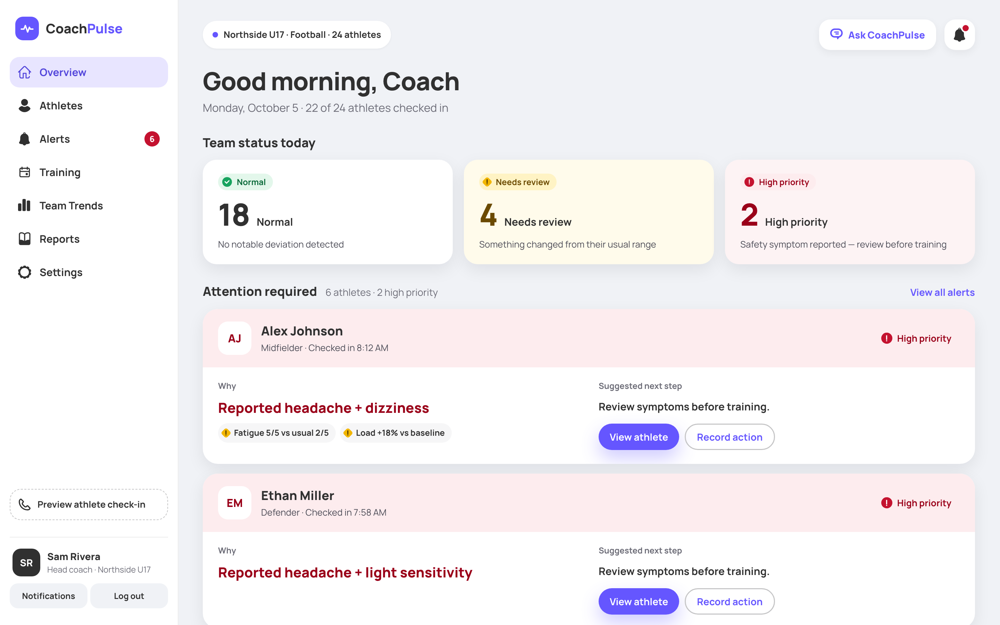
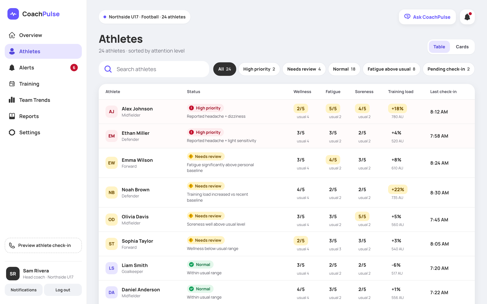
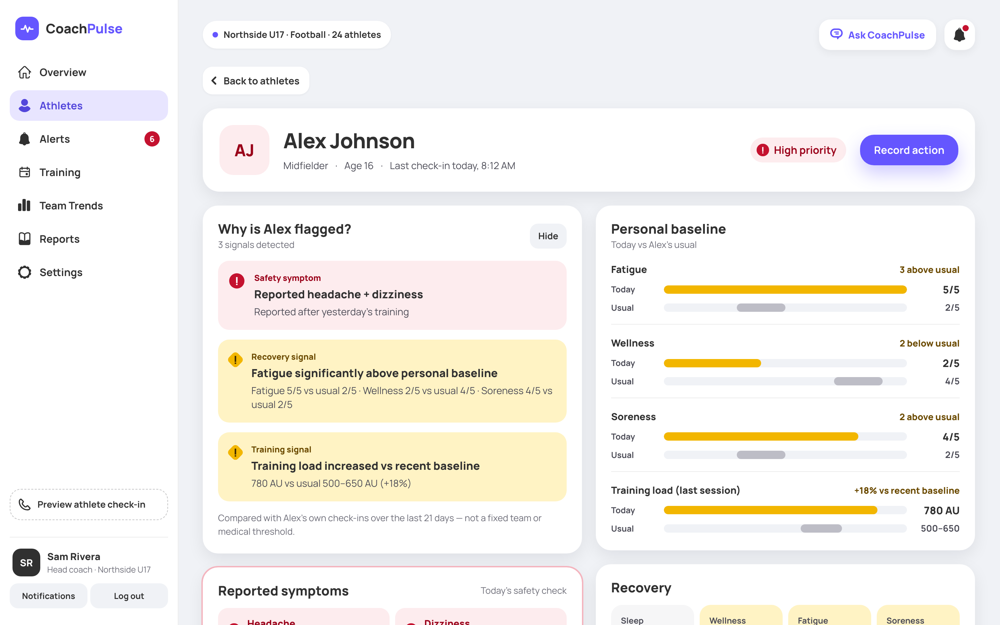
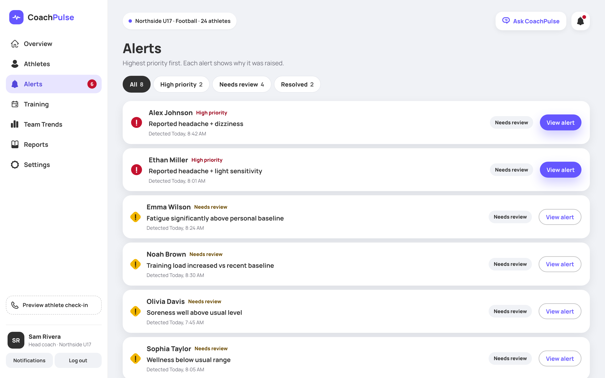
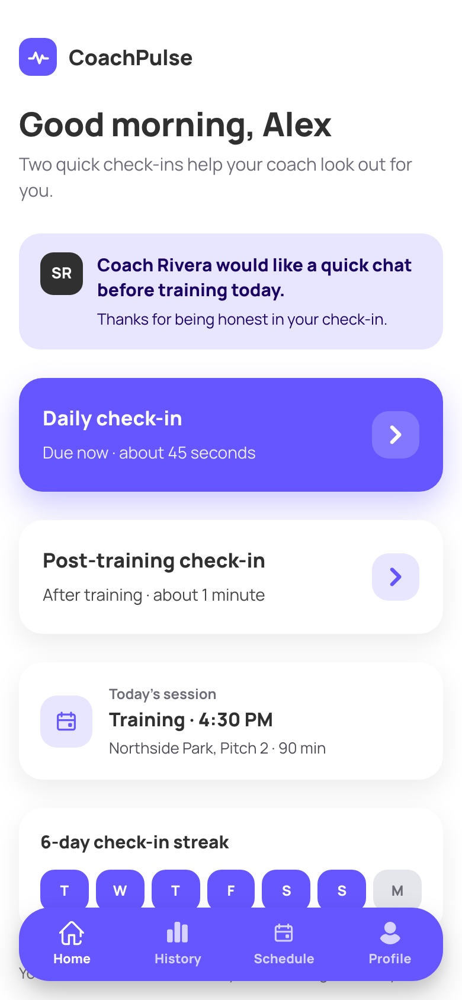
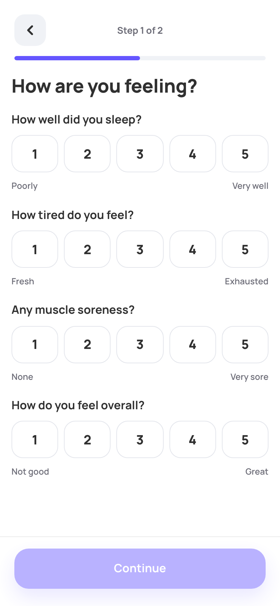

# CoachPulse

CoachPulse helps coaches see which athletes need attention today. Athletes send a short check-in every morning
and after training. CoachPulse compares each answer with that athlete's **own** usual levels and gives the coach a
sorted list, with the reasons in plain language.

> **Observations, not diagnoses.** CoachPulse never diagnoses, never clears anyone to play, and never shows a
> numeric risk score. Decisions stay with the coach and, when needed, a medical professional.

## Screenshots

From the sample-data mode (`npm run dev:mock`), with a fictional team.

| Coach overview | Athletes, sorted by attention |
|:---:|:---:|
|  |  |
| **Why an athlete is flagged** | **Alerts, highest priority first** |
|  |  |

<p align="center">
  
  &nbsp;&nbsp;&nbsp;
  
  <br>
  <b>Athlete app:</b> home and the daily check-in
</p>

## How it works

1. **The coach** signs up, creates a team and shares its join code.
2. **Athletes** join with the code and check in from their phone:
   - every morning: sleep, fatigue, muscle soreness and overall wellness (1–5), plus any symptoms;
   - after training: effort (RPE), duration, tiredness, soreness, weight before and after, plus any symptoms.
3. **The backend** builds each athlete's personal baseline from their last 21 days and assesses every check-in as
   it arrives.
4. **The coach dashboard** sorts the team by attention and explains every flag, for example fatigue well above
   that athlete's usual level, or a session much harder than usual.
5. **The coach follows up** and records what they did (reviewed with the athlete, modified training, contacted a
   parent or guardian, referred to a medical professional…), building an audit trail.

## Who gets flagged

| Status | When |
|---|---|
| **High priority** | The athlete reported a safety symptom. Only a symptom can make someone high priority. |
| **Needs review** | Fatigue or soreness 2+ points above their usual, wellness 2+ points below it, or a session load (minutes × RPE) 15%+ above their usual. |
| **Normal** | Everything is within their usual range. |

A baseline needs 7 days of morning check-ins (and 4 sessions for training load). Until then only safety symptoms
flag, and the coach sees "Baseline still forming". When 5 or more athletes report fatigue above their usual, the
overview shows a team pattern, so the coach can look at the session plan instead of each athlete.

The thresholds are placeholders until a qualified sports-medicine professional reviews them. The full rules are in
the [baseline algorithm](docs/baseline-algorithm.md) and the [risk model](docs/risk-model.md).

## Tech stack

| Part | Built with |
|---|---|
| Web app (`frontend/`) | React 19, TypeScript, Vite 8, React Router 8, CSS Modules; Vitest and oxlint |
| API (repository root) | Java 17, Spring Boot 4.1: Web MVC, Security with JWT bearer tokens, Data JPA, Validation |
| Database | PostgreSQL (hosted on Supabase), schema managed by Liquibase |
| CI | GitHub Actions on every pull request to `main`: API tests against a throwaway Postgres 17, and frontend lint, tests, build and a smoke test of the production build |

```
src/main/java/com/coachpulse/   API: user (accounts, sign-in), team, checkin, baseline, risk, security
src/main/resources/db/          Liquibase changelogs
frontend/                       web app: coach dashboard and athlete check-in app (see frontend/README.md)
docs/                           API contract, baseline algorithm, risk model
.github/workflows/              CI: ci.yml (API), frontend.yml (web app)
```

## Run it locally

You need JDK 17 (with `JAVA_HOME` pointing to it), Node.js 22.22 or newer, and either the team's Supabase database
password or Docker.

### 1. API: http://localhost:8080

```bash
export JWT_SECRET="$(openssl rand -base64 32)"
export DB_PASSWORD="<the team's Supabase database password>"
./mvnw spring-boot:run
```

To use a local database instead of Supabase (the same setup as CI):

```bash
docker run -d --name coach-pulse-db -p 5432:5432 \
  -e POSTGRES_DB=coach_pulse -e POSTGRES_USER=postgres -e POSTGRES_PASSWORD=postgres postgres:17
export SPRING_DATASOURCE_URL=jdbc:postgresql://localhost:5432/coach_pulse
export SPRING_DATASOURCE_USERNAME=postgres
export SPRING_DATASOURCE_PASSWORD=postgres
export JWT_SECRET="$(openssl rand -base64 32)"
./mvnw spring-boot:run
```

Liquibase creates the tables on startup.

### 2. Web app: http://localhost:5173

Run npm inside `frontend/`; the repository root is the Maven project.

```bash
cd frontend
npm install
npm run dev
```

The dev server forwards `/api` to the API on port 8080. Create a coach account at `/signup` and set up a team;
athletes join at `/athlete/join` with the team's code.

No API running? `npm run dev:mock` opens the app with a fictional sample team and no sign-in.

### Tests

```bash
./mvnw verify                                             # API, with the database variables above
cd frontend && npm test && npm run lint && npm run build  # web app
```

## Project status

**Working end to end:** coach sign-up and sign-in, team setup with a join code, athletes joining and sending both
check-ins, personal baselines, the risk engine, and the coach overview, athlete list, athlete profiles and alerts.

**Next:**

- Saving coach actions on the server. The dialog and audit trail are built; the endpoint isn't yet.
- Raising alerts automatically from assessments.
- Endpoints for the Training, Trends, Reports and Settings screens, which show sample data for now.
- CoachPulse Assistant: an AI helper that answers coach questions from the team's own data. The drawer is built
  with prepared answers, and it will never diagnose.

## Documentation

- [API contract](docs/api-contract.md): endpoints, JSON shapes and the error format
- [Baseline algorithm](docs/baseline-algorithm.md) and [risk model](docs/risk-model.md): how athletes are flagged
- [Web app](frontend/README.md): routes, sign-in, sample data and demo scenarios
- [Backend reference](#backend-reference) below: authentication, roles and endpoints

## Backend reference

### Backend JWT configuration

Set `JWT_SECRET` to a random value with at least 32 bytes before starting the
Spring Boot application. Generate a value with:

```bash
export JWT_SECRET="$(openssl rand -base64 32)"
```

JWTs use HS256 and expire after 15 minutes by default. Set
`app.security.jwt.expiration` to another ISO-8601 duration to change the
lifetime. Tokens contain only the subject (user ID), the user's `role`, the
issued-at time, and the expiration time.

### Protected endpoints

Every API route requires a valid JWT in the `Authorization: Bearer <token>`
header, except `POST /api/auth/register`, `POST /api/auth/login`, and
`POST /api/auth/logout`. The token's signature, expiration, and `role` claim are
verified before the request reaches a controller. Missing, malformed, tampered,
expired, or wrongly signed tokens return `401` with a `WWW-Authenticate: Bearer`
header. Tokens in query parameters or form bodies are not accepted, and public
auth endpoints ignore any bearer token so a stale one cannot block login.

Controllers read the verified identity from the authentication context, for
example `@AuthenticationPrincipal Jwt jwt` and `jwt.getSubject()` for the user
ID. Never take the user ID or role from request bodies, headers, or parameters.

### Role authorization

Role permissions are enforced on the server with method security. Annotate a
controller method with the roles allowed to call it:

```java
// Coach only
@PreAuthorize("hasRole('COACH')")
public ResponseEntity<?> coachEndpoint() {
   // ...
}

// Coach OR Admin
@PreAuthorize("hasAnyRole('COACH', 'ADMIN')")
public ResponseEntity<?> coachOrAdminEndpoint() {
   // ...
}
```

Roles come only from the verified JWT. There is no role hierarchy, so `ADMIN`
does not automatically get `COACH` or `ATHLETE` permissions; list every role an
endpoint allows. An authenticated user without an allowed role gets `403` in the
standard Problem Details format; a request with no valid token still gets `401`.
Hiding pages or buttons in the frontend is only for user experience. Every
restricted endpoint must have its own role check on the server.

### User roles

CoachPulse roles are defined in `UserRole`: `ATHLETE`, `COACH`, and `ADMIN`.
They match the `ck_users_role` database constraint, so every user has exactly
one valid role. Login puts the role in the JWT `role` claim. A bearer token
whose role is missing or not one of these exact names is rejected with `401`.
For valid tokens the role is available to authorization logic as the authority
`ROLE_<NAME>` (for example `ROLE_COACH`, usable with `hasRole("COACH")`).

### User registration

`POST /api/auth/register` accepts `email`, `password`, `firstName`, and
`lastName`. Email and names are trimmed, and email is stored in lowercase.
New self-registered accounts receive the `COACH` role; clients cannot choose a
privileged role. Passwords are stored as PBKDF2 hashes and are never included
in the response. Success returns `201 Created`; invalid fields return `400`,
and an email that is already registered returns `409` using the standard
Problem Details response format.

### Login and logout

`POST /api/auth/login` accepts `email` and `password`. Successful login returns
a signed bearer JWT in `accessToken` and its configured lifetime in
`expiresIn` seconds. The token subject is the user's ID; passwords are not
included in its claims. Invalid credentials return `401` with the same generic
message whether the email is unknown or the password is wrong.

`POST /api/auth/logout` returns `204 No Content`. JWTs are stateless, so logout
means the client discards its token; a previously issued token remains valid
until it expires. Clients should remove the token from local storage on logout.

### Teams and the coach dashboard

`GET /api/me` returns the signed-in user, their athlete profile id (athletes
only), and their team memberships.

`POST /api/teams` (COACH or ADMIN) creates a team with `name`, `sport`, and
optional `ageGroup` and `trainingFrequency`. The caller becomes its
`HEAD_COACH`, and the team gets a unique join code such as `D5C-F29T`.

The dashboard reads `GET /api/teams/{teamId}`, `/athletes/today`,
`/alerts?status=&limit=`, and `/activity?limit=` (limits are capped at 100).
These answer `404` unless the caller coaches the team, so team ids cannot be
probed. Formats are in `docs/api-contract.md`. "Today" is the calendar day in
the server's time zone.

### Athletes and check-ins

Athletes cannot self-register. They join with their coach's team code:
`GET /api/auth/join/{code}` (public) shows the team, and `POST /api/auth/join`
(public) creates the `ATHLETE` account, its athlete profile, and the team
membership in one transaction. The role is never taken from the request.

`POST /api/athletes/{athleteId}/morning-checkins` and `/workout-checkins` are
for the athlete only. `GET /api/athletes/{athleteId}/today` and
`/checkins?days=` (up to 60) are for the athlete and their team's coaches;
anyone else gets `404`. `symptoms` is required on both check-ins, so a missing
answer is never stored as "no symptoms".

### Personal baselines

Each athlete's usual wellness scores and training load are calculated live
from their own last 21 days of check-ins (`BaselineService`), and today's
check-ins are compared with them (`DeviationDetector`). The rules and thresholds
are in `docs/baseline-algorithm.md` and `BaselineRules`.

### Risk engine

`RiskEngine` scores the deviations 0–100 and sets the `GREEN`/`YELLOW`/`RED`
status (`docs/risk-model.md`, `RiskRules`). Only a safety symptom can make an
athlete `RED`. Every check-in is assessed when it is submitted and stored in
`risk_assessments` with its score, reasons, and engine version; the dashboard
shows each athlete's latest assessment from today. The score is never sent to
clients. Alerts are not raised from assessments yet.

## Deploying the backend to AWS Elastic Beanstalk

Use the **Java SE** platform (Corretto 17 or newer). It runs the Spring Boot
JAR directly; no WAR is needed.

1. Build: `./mvnw clean package`. This creates `target/demo-0.0.1-SNAPSHOT.jar`.
   The full-application test (`CoachPulseApplicationTests`) only runs when
   `DB_PASSWORD` is set, so the build works without database credentials.
2. Create the environment and upload that JAR.
3. In **Configuration → Updates, monitoring, and logging → Environment
   properties**, set:

   | Property | Value |
   |---|---|
   | `SERVER_PORT` | `5000` (the port Beanstalk's nginx forwards to) |
   | `DB_PASSWORD` | the Supabase database password |
   | `JWT_SECRET` | a random value of at least 32 bytes (`openssl rand -base64 32`) |
   | `CORS_ALLOWED_ORIGINS` | only if the web app is on another address: its exact origin(s), comma-separated, e.g. `https://app.example.com`. Leave empty with the single CloudFront setup below |

4. With a load balancer, set its **health check path** to `/api/health`.
   Every other route requires sign-in, so the default `/` answers `401`.

On startup the app runs any pending Liquibase migrations against the database.

## Hosting the app on CloudFront (web app and API on one address)

One CloudFront distribution serves both: the web app from a private S3 bucket,
and every `/api/*` request from the Beanstalk API. Browsers get HTTPS, the web
app and the API share one origin (so no CORS setup), and Beanstalk only needs
plain HTTP.

```
https://<distribution>.cloudfront.net/            → S3 bucket (web app)
https://<distribution>.cloudfront.net/api/...     → Elastic Beanstalk (API), port 80
```

### 1. Build the web app

```bash
cd frontend
npm run build
```

The build reads `frontend/.env.production`, which sets
`VITE_API_BASE_URL=https://d226wgv8g9m5g7.cloudfront.net/api`: the same address
as the web app, so requests stay same-origin. Change it there if the
distribution changes (local `npm run dev` ignores it and keeps using `/api`).
This creates `frontend/dist` (`index.html`, `favicon.svg` and `assets/`).

### 2. Put it in a private S3 bucket

1. **S3 → Create bucket**, in the same region as Beanstalk. Keep **Block all
   public access** on: only CloudFront will read it.
2. Upload the **contents** of `frontend/dist` (not the folder itself), so
   `index.html` sits at the top of the bucket next to `assets/`.

### 3. Add the bucket as a second origin

**CloudFront → your distribution → Origins → Create origin:**

| Setting | Value |
|---|---|
| Origin domain | the bucket (`<bucket>.s3.<region>.amazonaws.com`) |
| Origin access | **Origin access control settings** → **Create new OAC** (defaults) |

Save, then use **Copy policy** in the banner and paste it into **S3 → the bucket
→ Permissions → Bucket policy**. Without it CloudFront gets `403 Access Denied`.

### 4. Send `/api/*` to Beanstalk

**Behaviors → Create behavior:**

| Setting | Value |
|---|---|
| Path pattern | `/api/*` |
| Origin | the Beanstalk origin (protocol **HTTP only**, port **80**) |
| Viewer protocol policy | Redirect HTTP to HTTPS |
| Allowed HTTP methods | GET, HEAD, OPTIONS, PUT, POST, PATCH, DELETE |
| Cache policy | **CachingDisabled** (API answers are per user) |
| Origin request policy | **AllViewerExceptHostHeader** (forwards the bearer token and bodies) |

### 5. Serve the web app by default

1. **CloudFront → Functions → Create function** (`spa-routing`, cloudfront-js
   2.0) with this code, then **Publish**:

   ```js
   // Paths without a file extension are pages of the app (e.g. /athletes/123):
   // serve index.html and let the app's router show the page.
   function handler(event) {
     var request = event.request;
     if (!request.uri.includes('.')) {
       request.uri = '/index.html';
     }
     return request;
   }
   ```

2. **Behaviors → Default (\*) → Edit:**

   | Setting | Value |
   |---|---|
   | Origin | the S3 bucket |
   | Viewer protocol policy | Redirect HTTP to HTTPS |
   | Allowed HTTP methods | GET, HEAD |
   | Cache policy | CachingOptimized |
   | Origin request policy | none |
   | Function associations → Viewer request | CloudFront Functions → `spa-routing` |

3. **General → Settings → Edit → Default root object:** `index.html`.

Use the function, not custom error responses: error responses apply to every
path, so they would also turn the API's real `403` and `404` answers into the
web app's page.

### 6. Leave `CORS_ALLOWED_ORIGINS` empty

The web app and the API share one address, so the API needs no allowed origins.
If you do set `CORS_ALLOWED_ORIGINS` (for example for a second site), include
the distribution's address too, e.g. `https://d226wgv8g9m5g7.cloudfront.net`:
CloudFront changes the `Host` the API sees, so the API treats the web app's
requests as cross-origin and would reject them if the list leaves it out.

### 7. Check it

Wait until the distribution is deployed, then:

- `https://<distribution>.cloudfront.net/api/health` → `{"status":"UP"}`
- `https://<distribution>.cloudfront.net/` → the sign-in page; sign in works
- Reloading a deeper page such as `/athletes` shows that page, not an error

### Updating the web app

Run `npm run build`, upload the new `dist` contents to the bucket, then
**Invalidations → Create invalidation** with `/index.html`. The files in
`assets/` have new names on every build, so only `index.html` needs it.
